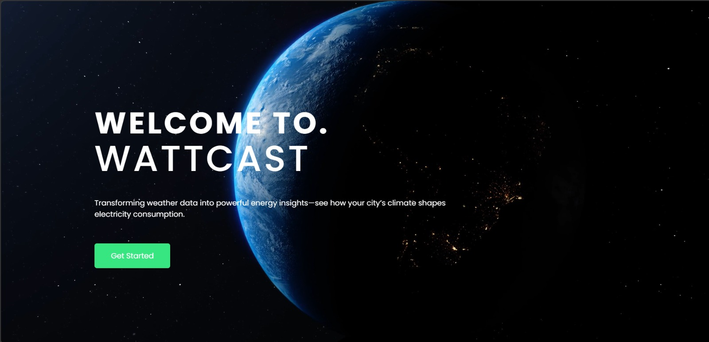

# ⚡ WattCast — AI-Based Electricity Consumption Forecasting Platform

An AI-powered web platform for forecasting electricity consumption using weather data, machine learning, and interactive analytics.



WattCast is a full-stack web application developed to forecast electricity consumption across Saudi cities using weather data and machine learning.

The platform combines real-time weather data, historical electricity consumption, predictive analytics, interactive dashboards, automated reports, and AI-based classification in a single web application.

This project was developed as the final project of my Software Engineering Internship at Saudi Electricity Company (SEC).

---

## ✨ Key Features

- Electricity consumption forecasting using machine learning
- Real-time weather data integration
- 16-day electricity consumption forecasts
- Historical electricity consumption analysis
- Comparison between Saudi cities
- Peak consumption analysis
- Interactive dashboards and data visualizations
- Automated PDF, CSV, JSON, and PNG reports
- AI-based text classification
- Cost and emissions estimation
- Administrative dashboard

---

## 🛠️ Tech Stack

**Backend**
- Python
- Flask
- SQL / SQLite

**Frontend**
- HTML
- CSS
- JavaScript

**Machine Learning & Data**
- Scikit-learn
- Pandas
- NumPy

**APIs**
- OpenWeather API

---

## 📁 Project Structure

```text
electricity-consumption-forecast/
│
├── backend/          # Weather update and backend utilities
├── data/             # Historical electricity data
├── static/
│   ├── css/          # Application styles
│   └── js/           # Frontend JavaScript
├── templates/
│   ├── admin/        # Admin dashboard
│   └── dashboard/    # Analytics dashboards
│
├── app.py            # Main Flask application
├── models.py         # Database models
├── weather.py        # Weather processing
├── utils.py          # Utility functions
├── requirements.txt  # Python dependencies
└── README.md
```text
...
```
## 🎥 Project Demo

Watch WattCast in action — from electricity consumption forecasting and weather integration to interactive analytics dashboards and automated reporting.

[](https://youtu.be/UCmUOYrSB7g)

▶️ [Watch the full project demo on YouTube](https://youtu.be/UCmUOYrSB7g)

